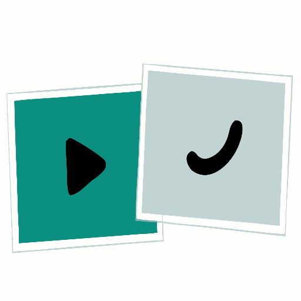

<div align="center">



<br/>

[](https://github.com/OguzGurv2/Animation-State-Validator)

<br/>

[](https://vitejs.dev/)
[](https://developer.mozilla.org/en-US/docs/Web/JavaScript)
[](https://airbnb.io/lottie/)
[](https://rive.app/)

[]()
[](https://github.com/OguzGurv2/Animation-State-Validator/pulls)

</div>


A focused Vite playground for validating animation behavior across **Lottie** and **Rive** in one page.


Use this repo when you want to:

- test animation states quickly in-browser
- compare interaction behavior between engines
- prototype add/remove state flows before integrating into a product

## What This App Does

The UI has two independent panels:

- `Lottie` panel:
  - Loads built-in JSON presets from `assets/lottie/select-advanced-plan/`
  - Supports adding new animations/states through a modal
  - Allows state-level and animation-level deletion with fallback selection
- `Rive` panel:
  - Loads built-in preset from `assets/rive/cart-icon-final.riv`
  - Supports loading local `.riv` files
  - Tries to apply semantic state actions (`Idle`, `Hover`, `Click`) by:
    - matching state machine inputs first
    - falling back to animation names
    - falling back to synthetic pointer/mouse interaction

Both panels provide:

- idle-first default selection
- chip-based animation/state selection
- playback controls (`Play`, `Pause`, `Stop`)
- status line updates for success/error states

## Tech Stack

| Layer | Technology |
|---|---|
| Runtime | [Vite 5](https://vitejs.dev/) |
| Language | JavaScript (ESM) |
| Lottie engine | [lottie-web](https://airbnb.io/lottie/) |
| Rive engine | [@rive-app/canvas](https://rive.app/) |
| Tests | `node:test` + `node:assert/strict` |

## Quick Start

```bash
npm install
npm run dev
```

The dev server is configured to run on:

- `http://localhost:3000/`

`vite.config.js` enforces `strictPort: true`, so Vite will fail instead of silently switching ports.

## Scripts

| Script | Description |
|---|---|
| `npm run dev` | Start local development server |
| `npm run build` | Create production build in `dist/` |
| `npm run preview` | Serve built output locally |
| `npm test` | Run utility unit tests |

## Project Structure

```text
.
├─ assets/
│  ├─ lottie/
│  │  └─ select-advanced-plan/
│  │     ├─ idle.json
│  │     ├─ click.json
│  │     ├─ hover.json
│  │     └─ hover-off.json
│  └─ rive/
│     └─ cart-icon-final.riv
├─ src/
│  ├─ main.js                  # Entry point, wires DOM to feature modules
│  ├─ lottie.js                # Lottie runtime lifecycle + dynamic state management
│  ├─ rive.js                  # Rive runtime lifecycle + quick action logic
│  ├─ chips.js                 # Shared chip/control rendering helpers
│  ├─ modal.js                 # Lottie add-animation/add-state modal controller
│  ├─ helpers/
│  │  └─ preset-utils.js       # Pure preset-selection and deletion-fallback helpers
│  └─ style.css                # App styling
├─ test/
│  └─ preset-utils.test.js     # Unit tests for preset/deletion helper behavior
├─ index.html                  # App shell + panel markup
├─ vite.config.js              # Vite configuration (including .riv asset inclusion)
└─ package.json
```

## Architecture Overview

### 1) Bootstrapping

- `src/main.js` imports styles and initializes two independent feature modules.
- Each module receives all required DOM references as a single object.

### 2) Shared UI Utilities

- `src/chips.js` centralizes reusable UI behavior:
  - filename-to-label normalization
  - chip/group creation
  - selected-state rendering
  - playback button decoration and active-state rendering

### 3) Pure Selection Logic

- `src/helpers/preset-utils.js` has side-effect-free functions that implement:
  - idle-first preset resolution
  - global default preset resolution
  - deterministic animation fallback after deletion

### 4) Feature Modules

- `src/lottie.js`:
  - tracks loaded instance + UI state
  - maps preset keys to animation definitions
  - supports dynamic state imports from local JSON files
- `src/rive.js`:
  - tracks loaded instance + UI state
  - resolves source as `ArrayBuffer` when possible
  - uses a load token to ignore stale async loads
  - applies semantic quick actions for `Idle/Hover/Click`

## State and Selection Rules

The app follows a few deterministic rules to avoid ambiguous UI behavior:

| Rule | Behaviour |
|---|---|
| **Idle-first preset preference** | If `idle.json` exists for an animation, it is the preferred preset |
| **Deletion fallback** | If the selected animation/state is deleted, the first valid fallback is auto-selected |
| **Empty state** | If no animation remains, panel state resets to "No ... loaded" |

These rules are tested in `test/preset-utils.test.js`.

## How To Extend

### Add New Built-In Lottie Presets

1. Add JSON files under `assets/lottie/<your-animation>/`.
2. Import the files in `src/lottie.js`.
3. Add entries to `LOTTIE_PRESET_DEFINITIONS`.
4. Update `lottieAnimStateFilesMap` for the animation group.

### Add New Built-In Rive Presets

1. Add `.riv` file under `assets/rive/`.
2. Import the asset URL in `src/rive.js`.
3. Add entries to `RIVE_PRESET_DEFINITIONS` with an `actionName`.

> Keep action names semantically consistent (`Idle`, `Hover`, `Click`) to preserve quick-action behavior.

## Testing

```bash
npm test
```

Current tests focus on core deterministic logic in `preset-utils`.

Suggested additional tests (future):

- integration tests for modal validation flow
- interaction tests for chip selection/deletion
- Rive quick-action fallback tests (input → animation → pointer)

## Troubleshooting

| Issue | Solution |
|---|---|
| Dev server does not start | Port `3000` may already be in use (`strictPort: true` prevents auto-switch) |
| Rive preset loads but state does not visibly change | The source file may use different input/animation naming than `Idle/Hover/Click` |
| Lottie state import fails | Malformed JSON will surface as `Invalid JSON` in modal error area |


<div align="center">

**Built with passion for animation.**

[](https://github.com/OguzGurv2/Animation-State-Validator)

This is a public project, open to use for everyone!

</div>
